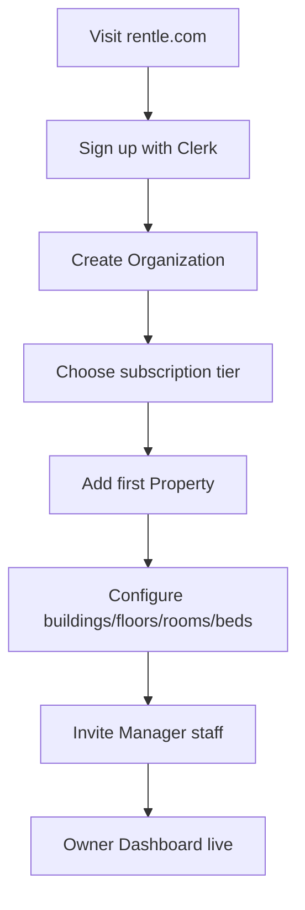
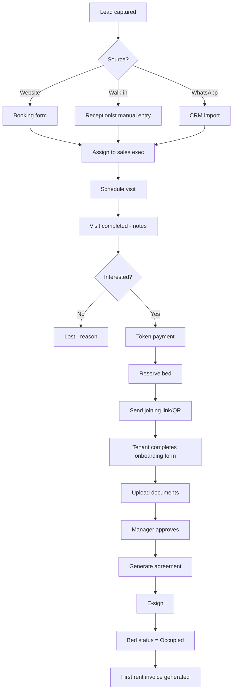
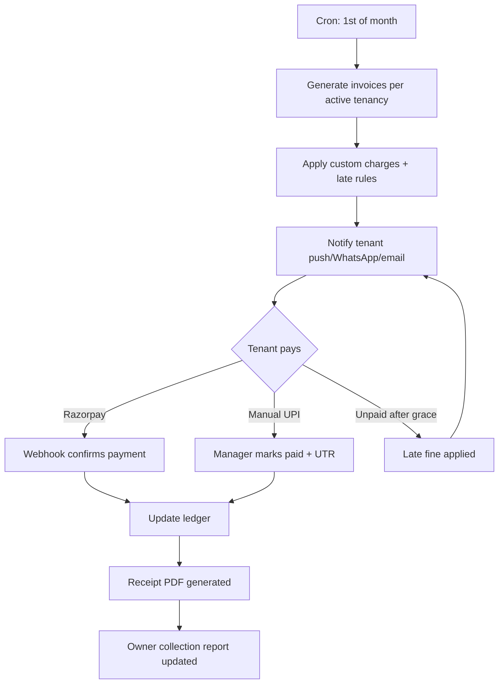
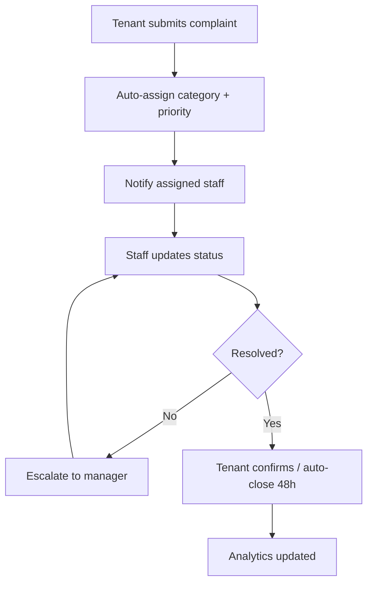
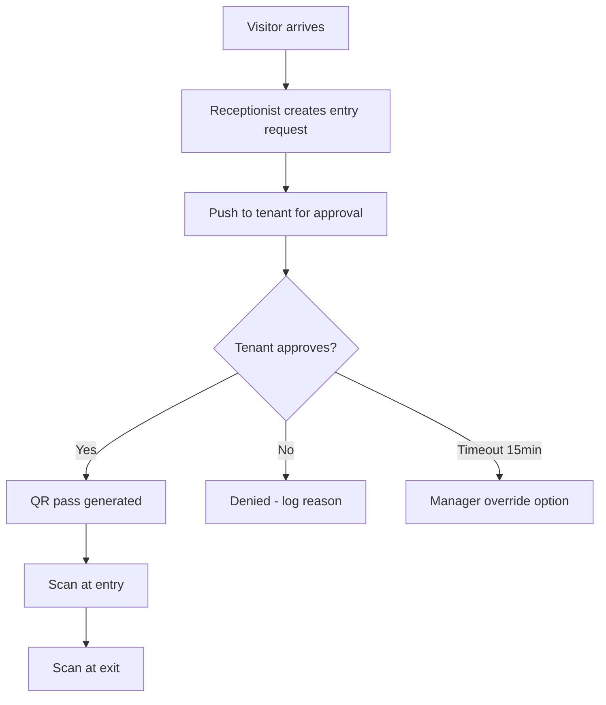
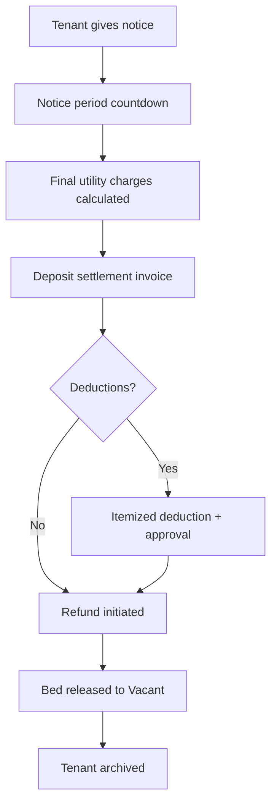
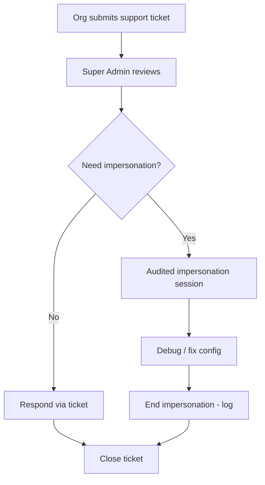
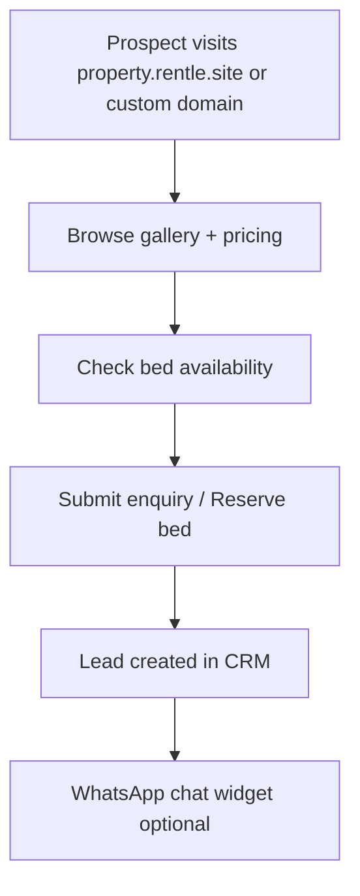

# 03 — User Flows

---

## Flow 1: Organization Onboarding

**Steps:**
1. Owner signs up → Clerk creates user + org
2. Webhook syncs `Organization` record in PostgreSQL
3. Setup wizard: property name, address, rent cycle, UPI/bank details
4. Bed inventory import (CSV or manual)
5. Optional: connect Razorpay merchant account

---

## Flow 2: Lead → Tenant Conversion

---

## Flow 3: Monthly Rent Collection

---

## Flow 4: Tenant Complaint Resolution

---

## Flow 5: Visitor Entry (Tenant-Approved)

---

## Flow 6: Tenant Move-Out

---

## Flow 7: Super Admin Support

---

## Flow 8: White-Label Property Website

---

## Edge Cases (Must Handle)

| Flow | Edge Case | Behavior |
|------|-----------|----------|
| Lead conversion | Duplicate phone in CRM | Merge suggestion, block duplicate active lead |
| Rent | Partial payment | Allocate to oldest invoice; show balance |
| Bed transfer | Mid-month transfer | Prorate rent; close old tenancy line item |
| Delete room | Active tenant | Block delete (current MVP behavior preserved) |
| Payment webhook | Duplicate webhook | Idempotency key on `Payment.externalId` |
| Invite | Expired joining link | Regenerate; audit old invite |
