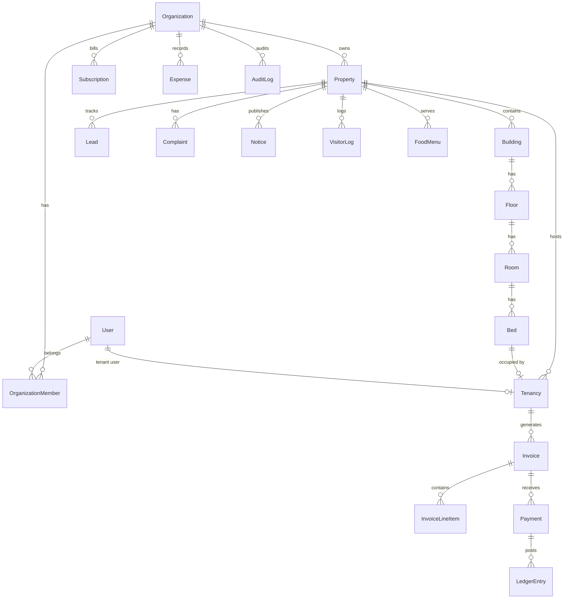
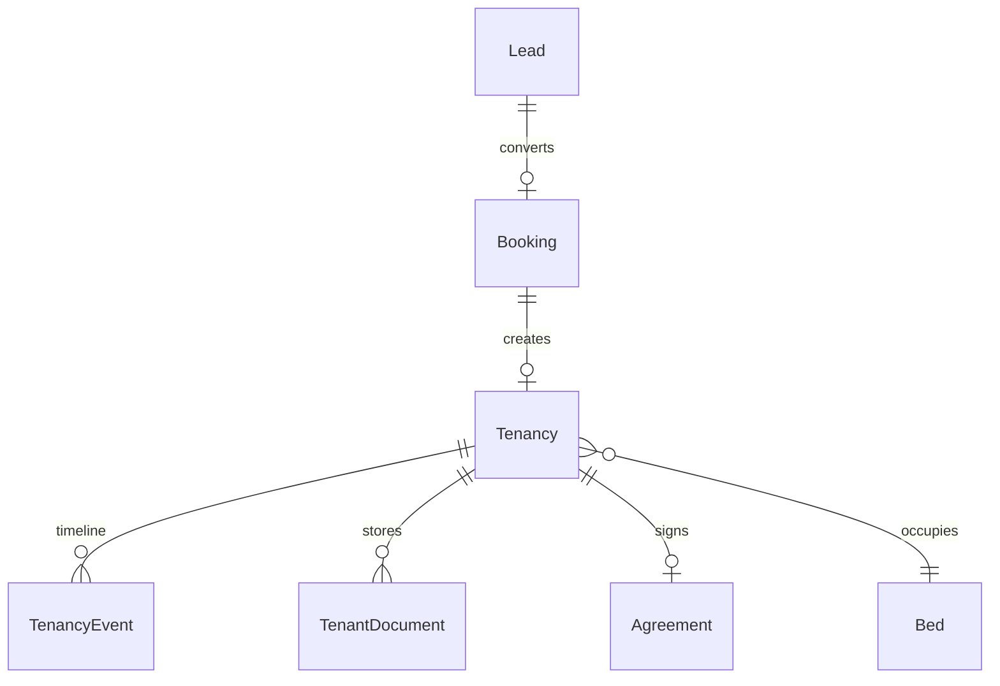
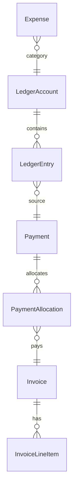
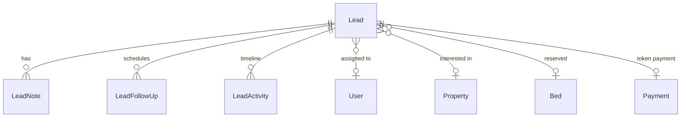
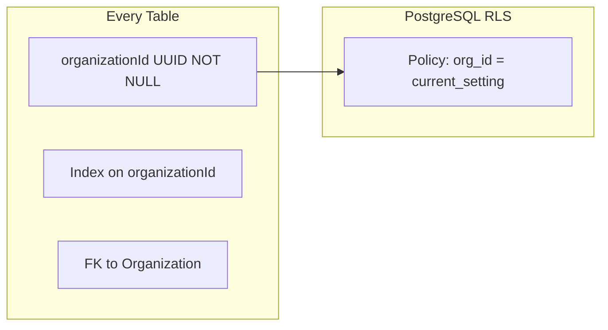

# 05 — Database ER Diagram

> Canonical schema: [06-prisma-schema.prisma](./06-prisma-schema.prisma)

---

## Core Entity Relationship (High Level)

---

## Tenant Lifecycle

---

## Payments & Accounting

---

## CRM Pipeline

---

## Multi-Tenancy Enforcement

---

## Key Indexes (Performance)

| Table | Index | Purpose |
|-------|-------|---------|
| `tenancies` | `(organizationId, propertyId, status)` | Active tenant lists |
| `beds` | `(roomId, status)` | Availability queries |
| `invoices` | `(organizationId, dueDate, status)` | Collection reports |
| `payments` | `(organizationId, paidAt)` | Revenue analytics |
| `leads` | `(organizationId, stage, assignedToId)` | CRM kanban |
| `audit_logs` | `(organizationId, createdAt DESC)` | Activity feed |
| `notifications` | `(userId, readAt, createdAt)` | Inbox |

---

## Soft Delete Strategy

Tables with `deletedAt`:
- `organizations`, `properties`, `rooms`, `beds`, `tenancies`, `leads`, `staff_profiles`

Hard delete only for:
- OTP tokens, session tokens, ephemeral queue jobs

---

## Optimistic Locking

Tables with `version Int @default(1)`:
- `tenancies`, `invoices`, `payments`, `beds` (status transitions)

Update pattern: `WHERE id = ? AND version = ?` → increment version.

---

## Data Volume Estimates (Year 3)

| Entity | Rows | Avg Row Size |
|--------|------|--------------|
| Organizations | 10,000 | 2 KB |
| Properties | 50,000 | 5 KB |
| Beds | 2,000,000 | 500 B |
| Tenancies | 1,000,000 | 3 KB |
| Invoices | 12,000,000/yr | 1 KB |
| Audit logs | 100M/yr | 500 B → partition by month |

**Partitioning:** `audit_logs`, `notifications` by `createdAt` (monthly partitions).
