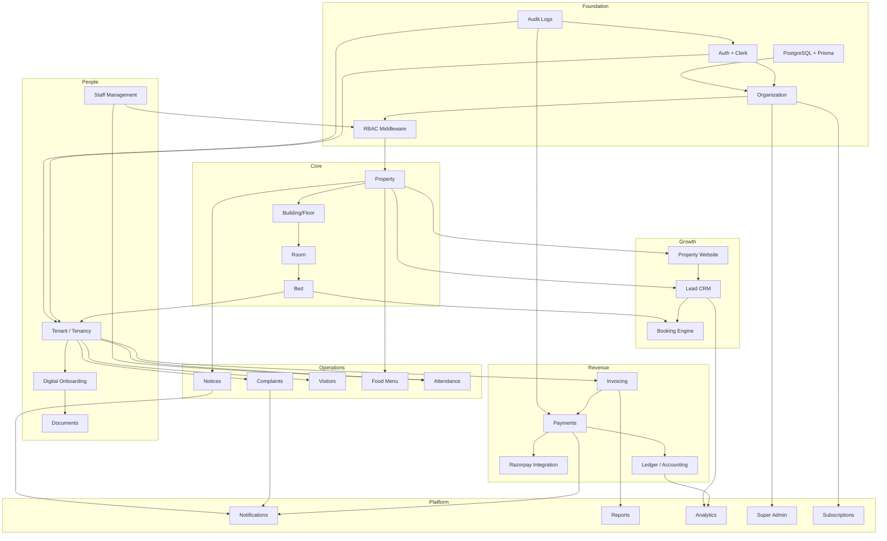

# 10 — Feature Dependency Graph

---

## Build Order (Strict)

| Phase | Modules | Depends On |
|-------|---------|------------|
| **0** | Monorepo, CI, Prisma migrate, Clerk | — |
| **1** | Auth, Organization, RBAC, Audit | Phase 0 |
| **2** | Property → Bed inventory | Phase 1 |
| **3** | Tenancy, Onboarding, Staff | Phase 2 |
| **4** | Invoicing, Payments, Razorpay | Phase 3 |
| **5** | Complaints, Notices, Notifications | Phase 3 |
| **6** | Lead CRM, Booking | Phase 2, 4 |
| **7** | Property Website, Public API | Phase 2, 6 |
| **8** | Accounting, Reports | Phase 4 |
| **9** | Visitors, Food, Attendance | Phase 3, 5 |
| **10** | Subscriptions, Super Admin | Phase 1, 4 |
| **11** | Analytics, Advanced Reports | Phase 8, 10 |

---

## Coupling Rules

1. **No upward dependencies** — Payment module must not import Lead module
2. **Cross-module communication** via domain events (NestJS EventEmitter → BullMQ)
3. **Shared types** only in `packages/shared`
4. **UI fetches via TanStack Query** — never direct Prisma in Next.js pages

---

## Parallel Workstreams (After Phase 2)

| Stream A | Stream B | Stream C |
|----------|----------|----------|
| Tenancy + Onboarding | Lead CRM | Complaints + Notices |
| Payments | Property Website | Staff + Attendance |

Streams merge at Phase 6 integration testing.

---

## MVP Feature Cut (Phase 1–4 = RentOk Parity)

Must ship before CRM/Website:
- ✅ Property → Bed management
- ✅ Tenant invite + onboarding
- ✅ Monthly invoices + Razorpay
- ✅ Complaints + Notices
- ✅ Owner + Tenant dashboards
- ✅ Basic reports (occupancy, collection)

---

## Risk Dependencies

| Risk | Mitigation |
|------|------------|
| Clerk org sync delays | Webhook + reconciliation cron |
| Razorpay webhook failures | Idempotency + dead letter queue |
| Bed status race conditions | Optimistic locking + DB transaction |
| Firebase migration data loss | Dry-run migration + rollback script |
