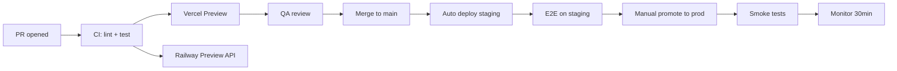

# 15 — Deployment Strategy

---

## Environment Tiers

| Environment | Purpose | URL |
|-------------|---------|-----|
| **Local** | Developer machines | `localhost:3000/4000` |
| **Preview** | PR deployments | `*.vercel.app` |
| **Staging** | QA + integration | `staging.rentle.com` |
| **Production** | Live customers | `app.rentle.com` |

---

## Service Mapping

| Service | Platform | Notes |
|---------|----------|-------|
| `apps/web` | Vercel | SSR, edge middleware, ISR for marketing |
| `apps/api` | Railway | NestJS, auto-scale 1–4 instances |
| PostgreSQL | Supabase | Mumbai region; connection pooling |
| Redis | Railway Redis | BullMQ + cache |
| Storage | Supabase Storage | Documents, images |
| CDN | Vercel Edge / Cloudflare | Static assets, property sites |
| DNS | Cloudflare | Custom domains for property websites |
| Mobile | App Store + Play Store | Flutter builds via Codemagic |

---

## Deployment Flow

---

## Database Migrations

1. `prisma migrate dev` locally
2. PR includes migration SQL — reviewed for locking
3. Staging: `prisma migrate deploy` in CI predeploy hook
4. Production: migrate **before** app deploy (expand-contract pattern)
5. Destructive migrations require maintenance window + backup

**Expand-Contract example:**
- Add new column (nullable) → deploy code reading both → backfill → deploy code writing new only → drop old column

---

## Environment Variables

| Var | Where | Secret |
|-----|-------|--------|
| `DATABASE_URL` | API (pooled) | Yes |
| `DIRECT_URL` | Migrations only | Yes |
| `CLERK_SECRET_KEY` | API + Web | Yes |
| `RAZORPAY_KEY_SECRET` | API | Yes |
| `REDIS_URL` | API | Yes |
| `NEXT_PUBLIC_CLERK_PUBLISHABLE_KEY` | Web | No |

Managed via Vercel + Railway secret stores. Rotated quarterly.

---

## Mobile Release

| Track | Frequency |
|-------|-----------|
| Internal TestFlight / Internal testing | Daily (CI) |
| Beta | Weekly |
| Production | Bi-weekly (aligned with API) |

**API compatibility:** Mobile apps support N and N-1 API versions.

---

## Rollback Procedure

| Component | Rollback |
|-----------|----------|
| Web (Vercel) | Instant promote previous deployment |
| API (Railway) | Redeploy previous image (< 2 min) |
| Database | Forward-fix preferred; restore from backup if critical |
| Mobile | Cannot rollback — feature flags on API instead |

---

## Zero-Downtime Requirements

- Health check: `GET /health` (DB + Redis ping)
- Graceful shutdown: drain connections 30s
- Rolling deploy on Railway
- No breaking API changes without version bump

---

## Custom Domain (Property Websites)

1. Owner adds CNAME → `cname.rentle.com`
2. Vercel domain API provisions SSL
3. Middleware routes by hostname → property CMS
4. Verify DNS before activation (TXT challenge)

---

## Cost Estimates (Production, Year 1)

| Service | Monthly |
|---------|---------|
| Vercel Pro | $20 |
| Railway (API + Redis) | $50–150 |
| Supabase Pro | $25–100 |
| Clerk Pro | $25 |
| Cloudflare | $0–20 |
| **Total** | ~$150–300/mo at launch scale |
